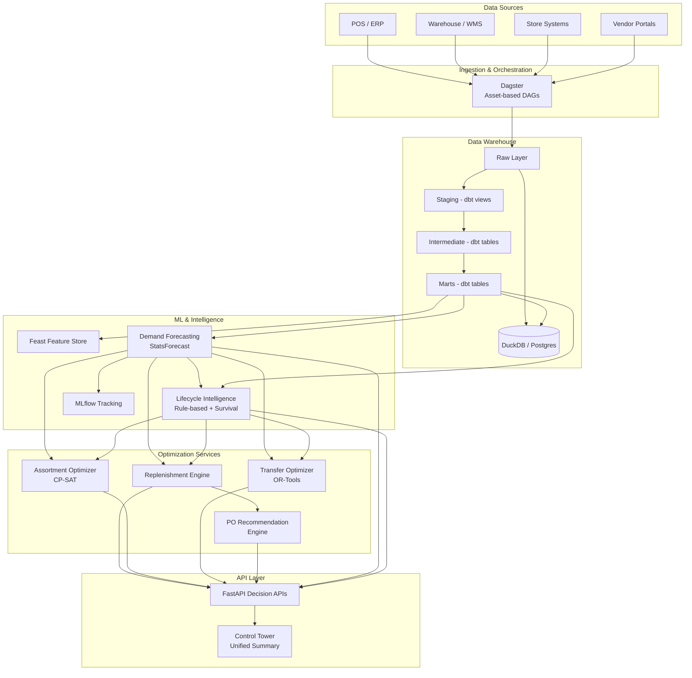

# Lenskart Retail Intelligence Platform

Production-grade monorepo for demand forecasting, lifecycle intelligence, assortment optimization, replenishment automation, transfer optimization, and vendor collaboration across ~2600 Lenskart stores.

## Architecture



## Repository Structure

```
├── apps/api/                   # FastAPI decision APIs + control tower
├── orchestration/dagster/      # Asset-based DAG definitions
├── transform/dbt/              # Data warehouse (staging → intermediate → marts)
├── ml/
│   ├── forecasting/            # StatsForecast / HierarchicalForecast
│   ├── optimization/           # OR-Tools optimization models
│   └── vendor/                 # Vendor scorecard & PO generation
├── services/
│   ├── lifecycle/              # Product lifecycle intelligence (v1 rules + v2 survival)
│   ├── replenishment/          # Reorder point & replenishment engine
│   ├── assortment/             # Display wall optimization (CP-SAT)
│   ├── transfers/              # Inter-store transfer engine (OR-Tools)
│   └── purchase_orders/        # PO lifecycle management
├── schemas/                    # Canonical Pydantic schemas
├── data/synthetic/             # Synthetic data generator
├── scripts/                    # Demo and utility scripts
├── infra/docker/               # Docker Compose (Postgres, MLflow, MinIO)
├── tests/                      # Unit, integration, smoke, and full-flow tests
└── docs/                       # Architecture and module documentation
```

## Quick Start

### Prerequisites
- Python 3.11+
- Docker & Docker Compose (optional, for infrastructure)

### Bootstrap & Run

```bash
# Install dependencies
make install

# Generate synthetic data + run dbt pipeline
make dbt-full

# Run tests
make test

# Start API server (http://localhost:8000/docs)
make api
```

### End-to-End Demo

```bash
# Full demo: data foundation → forecast → lifecycle → replenishment →
#            assortment → transfers → PO generation → control tower
make demo-e2e

# Skip data foundation if already loaded
make demo-e2e-quick
```

### Infrastructure (Optional)

```bash
make docker-up       # Start Postgres, MLflow, MinIO
make dagster-dev     # Start Dagster UI
make docker-down     # Stop infrastructure
```

## Daily Pipeline Flow

The Dagster-orchestrated daily pipeline runs at 6 AM:

```
1. Ingest       → Generate/load source data
2. Transform    → dbt: staging → dimensions → intermediate → marts
3. Validate     → dbt tests + data validation checks
4. Forecast     → Train models → batch inference → write forecasts
5. Lifecycle    → Classify SKU stages → recommended actions
6. Replenish    → Safety stock + reorder point → recommendations
7. Transfers    → Identify rebalancing opportunities → optimize
8. PO Generate  → Aggregate needs → vendor score → PO recommendations
```

## API Endpoints

| Endpoint | Description |
|----------|-------------|
| `GET /health` | Health check |
| `GET /api/v1/control-tower/summary` | Unified platform summary |
| `POST /api/v1/forecasts/run` | Trigger demand forecasts |
| `GET /api/v1/forecasts/latest` | Retrieve latest forecasts |
| `POST /api/v1/lifecycle/classify` | Run lifecycle classification |
| `GET /api/v1/lifecycle/sku/{id}` | Get SKU lifecycle stage |
| `GET /api/v1/replenishment/plan` | Get replenishment recommendations |
| `POST /api/v1/assortment/optimize` | Run assortment optimization |
| `GET /api/v1/transfers/recommendations` | Get transfer recommendations |
| `GET /api/v1/vendors/scorecards` | Get vendor scorecards |
| `POST /api/v1/purchase-orders/generate` | Generate PO recommendations |

Full API documentation available at `http://localhost:8000/docs` (Swagger UI).

## Modules

### Demand Forecasting
StatsForecast + HierarchicalForecast ensemble at SKU x Store x Week granularity. 5-level hierarchy reconciliation with quantile prediction intervals.

### Lifecycle Intelligence
Rule-based v1 classifier assigns each SKU to: **launch → growth → core → maturity → decline → exit**. Optional v2 survival-analysis scoring provides continuous health scores. Feeds into forecasting (uncertainty adjustment) and assortment (freshness scoring).

### Replenishment
Safety stock + reorder point engine with service-level targets by store cluster. Generates recommendations with urgency levels (emergency/urgent/normal) and reason codes.

### Assortment Optimization
CP-SAT solver maximizes composite scores (demand + trial + margin + freshness) subject to category coverage, brand diversity, and new-launch constraints. 5 pre-built scenario profiles.

### Transfer Optimization
OR-Tools optimizer identifies inter-store rebalancing opportunities. Prioritizes aging/EOL clearance with net-value maximization.

### Vendor Intelligence & Purchase Orders
Vendor scorecards (on-time delivery, quality, capacity). PO recommendations aggregate replenishment needs, apply MOQ/MOV rules, and allocate across vendors.

## Tech Stack

| Component | Technology |
|-----------|-----------|
| Orchestration | Dagster |
| Data Warehouse | dbt + DuckDB (dev) / Postgres (prod) |
| Forecasting | StatsForecast, HierarchicalForecast |
| Optimization | Google OR-Tools (CP-SAT) |
| Feature Store | Feast |
| Experiment Tracking | MLflow |
| API | FastAPI |
| Schemas | Pydantic v2 |
| Linting | Ruff, mypy |
| Testing | pytest |

## Data Model

| Entity | Description |
|--------|-------------|
| **stores** | ~2600 stores with type, format, cluster, capacity |
| **skus** | Products with category, fulfillment type, lifecycle stage |
| **vendors** | Suppliers with lead times, MOQ/MOV, reliability scores |
| **daily_sales** | Daily sales at store x SKU, split by fulfillment type |
| **daily_inventory** | On-hand, on-display, in-storage, in-transit quantities |
| **store_trials** | Try-on events (display demand signal) |
| **store_traffic** | Daily footfall, walk-ins, appointments |
| **transfers** | Inter-store inventory movements |
| **purchase_orders** | Vendor POs with line-level detail |

### Demand Signal Semantics

| Signal | Source | Meaning |
|--------|--------|---------|
| **sell_through_signal** | Sales | Physical product sold from stock |
| **display_interest_signal** | Trials | Customer tried on display frame |
| **prescription_order_signal** | Sales + Eye tests | Prescription order captured |

## Testing

```bash
make test              # All tests (unit + smoke)
make test-unit         # Unit tests only
make test-smoke        # Smoke tests (API + data + full flow)
make test-full-flow    # Full-flow integration test
make test-integration  # Integration tests (requires data)
```

## Documentation

- [Architecture & Sequence Diagrams](docs/architecture.md)
- [Lifecycle Intelligence](docs/lifecycle_intelligence.md)

## Production Hardening Next Steps

### Infrastructure
- **Database**: Migrate from DuckDB to Postgres/Redshift for concurrent access and horizontal scaling
- **Caching**: Add Redis layer for frequently-accessed API responses (control tower, scorecards)
- **Message queue**: Kafka/SQS for async pipeline triggering and event-driven updates

### Reliability
- **Circuit breakers**: Wrap all DuckDB/external calls with retry + circuit breaker patterns
- **Health checks**: Deep health checks validating DB connectivity, table freshness, model staleness
- **Alerting**: PagerDuty/Opsgenie integration for pipeline failures, SLA breaches, anomaly detection
- **Graceful degradation**: API should return stale cached data when pipelines fail

### Observability
- **Structured logging**: Migrate all loggers to structlog with JSON output for log aggregation
- **Metrics**: Prometheus metrics for forecast accuracy, stockout rates, pipeline latency
- **Tracing**: OpenTelemetry distributed tracing across Dagster → services → API
- **Dashboards**: Grafana dashboards for operational KPIs and pipeline health

### Data Quality
- **Great Expectations**: Replace custom validation with GE for comprehensive data quality contracts
- **Schema evolution**: Alembic migrations for analytical table schema changes
- **Data lineage**: Column-level lineage tracking in dbt + Dagster metadata

### ML Operations
- **Model registry**: Formal model versioning and promotion workflow in MLflow
- **A/B testing**: Shadow mode for new models before production rollout
- **Feature monitoring**: Detect feature drift and data distribution changes
- **Retraining triggers**: Automatic retraining when forecast accuracy degrades

### Security
- **Authentication**: OAuth2/JWT for API endpoints
- **RBAC**: Role-based access (viewer/operator/admin) for different API capabilities
- **Audit logging**: Track all write operations and pipeline executions
- **Secrets management**: HashiCorp Vault or AWS Secrets Manager for credentials

### Performance
- **Batch processing**: Partition large tables by date for incremental processing
- **Connection pooling**: SQLAlchemy connection pool for concurrent API requests
- **Async endpoints**: Convert heavy API endpoints to async with background task queues
- **CDN**: Cache static API responses (scenarios, stages) at edge
