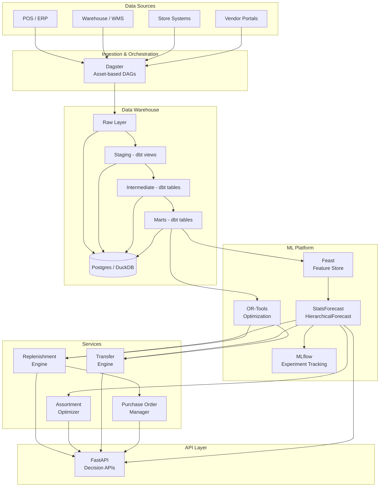

# Lenskart Retail Intelligence Platform

Production-grade monorepo for demand forecasting, assortment optimization, replenishment automation, and vendor collaboration across ~2600 Lenskart stores.

## Architecture



### Key Design Principles

- **Consumer-backwards**: Every decision optimizes for the end consumer experience
- **Store as signal node**: Stores generate demand signals (trials, footfall, eye tests) beyond just sales
- **Dual demand modeling**: Display demand (try-ons) and physical sell-through are modeled separately but linked
- **SKU x Store x Week granularity**: Forecasts at the most actionable level
- **Automated decision loops**: Forecast → Optimize → Execute → Measure

## Repository Structure

```
├── apps/
│   └── api/                    # FastAPI decision APIs
├── orchestration/
│   └── dagster/                # Asset-based DAG definitions
├── transform/
│   └── dbt/                    # Data warehouse modeling (staging → intermediate → marts)
├── ml/
│   ├── features/               # Feature engineering & Feast integration
│   ├── forecasting/            # StatsForecast / HierarchicalForecast
│   ├── optimization/           # OR-Tools replenishment & transfer optimization
│   └── vendor/                 # Automated PO generation
├── services/
│   ├── replenishment/          # Reorder point & replenishment engine
│   ├── assortment/             # Display wall optimization
│   ├── transfers/              # Inter-store transfer engine
│   └── purchase_orders/        # PO lifecycle management
├── schemas/                    # Canonical Pydantic schemas
├── data/synthetic/             # Synthetic data generator
├── infra/docker/               # Docker Compose (Postgres, MLflow, MinIO)
├── tests/                      # Unit, integration, and smoke tests
└── docs/
```

## Quick Start

### Prerequisites
- Python 3.11+
- Docker & Docker Compose (for infrastructure)

### Bootstrap & Run

```bash
# Install dependencies
make install

# Generate synthetic data (50 stores, 500 SKUs, 90 days)
make generate-data

# Run tests
make test

# Start API server (http://localhost:8000/docs)
make api

# Or run everything at once
make demo
```

### Infrastructure (Optional)

```bash
# Start Postgres, MLflow, MinIO
make docker-up

# Run dbt models
make dbt-run

# Start Dagster UI
make dagster-dev

# Stop infrastructure
make docker-down
```

## Data Model

| Entity | Description |
|--------|-------------|
| **stores** | ~2600 stores with type, format, cluster, capacity |
| **skus** | Products with category, fulfillment type (display/direct sell), lifecycle stage |
| **vendors** | Suppliers with lead times, MOQ/MOV, reliability scores |
| **daily_sales** | Daily sales at store x SKU, split by fulfillment type |
| **daily_inventory** | On-hand, on-display, in-storage, in-transit quantities |
| **store_trials** | Try-on events (display demand signal) |
| **store_traffic** | Daily footfall, walk-ins, appointments |
| **transfers** | Inter-store inventory movements |
| **purchase_orders** | Vendor POs with line-level detail |
| **pricing_promotions** | Discount and promotional events |

## Tech Stack

| Component | Technology |
|-----------|-----------|
| Orchestration | Dagster |
| Data Warehouse | dbt + Postgres (DuckDB for local dev) |
| Forecasting | StatsForecast, HierarchicalForecast |
| Optimization | OR-Tools |
| Feature Store | Feast |
| Experiment Tracking | MLflow |
| API | FastAPI |
| Object Storage | MinIO (S3-compatible) |
| Linting | Ruff, mypy |
| Testing | pytest |

## API Endpoints

| Endpoint | Description |
|----------|-------------|
| `GET /health` | Health check |
| `POST /api/v1/forecasts/generate` | Generate demand forecasts |
| `GET /api/v1/forecasts/latest` | Retrieve latest forecasts |
| `GET /api/v1/replenishment/plan` | Get replenishment recommendations |
| `POST /api/v1/replenishment/execute` | Execute replenishment plans |
| `GET /api/v1/assortment/recommendations` | Get assortment optimization |
| `GET /api/v1/assortment/clusters` | Get store clusters |
| `GET /api/v1/transfers/recommendations` | Get transfer recommendations |
| `POST /api/v1/transfers/execute` | Execute transfers |
| `POST /api/v1/purchase-orders/create` | Create purchase order |
| `GET /api/v1/purchase-orders/suggestions` | Automated PO suggestions |
