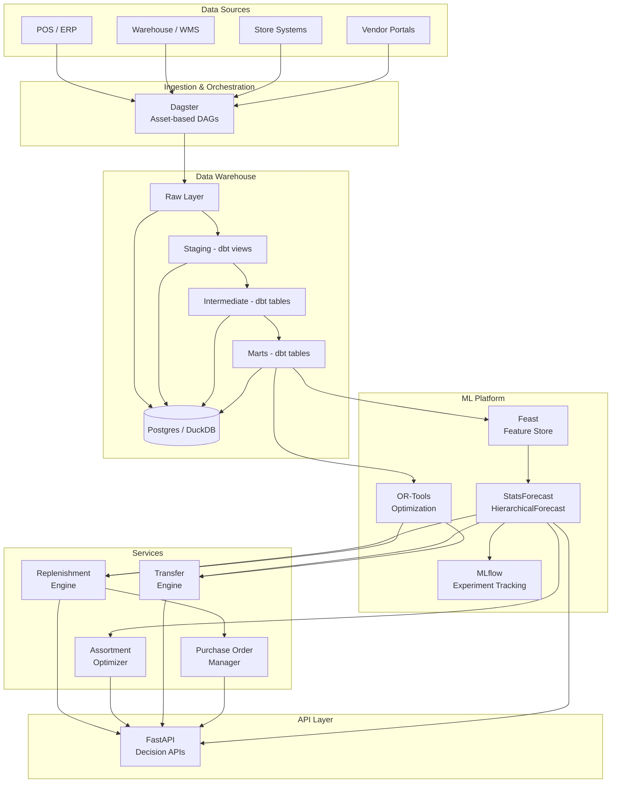
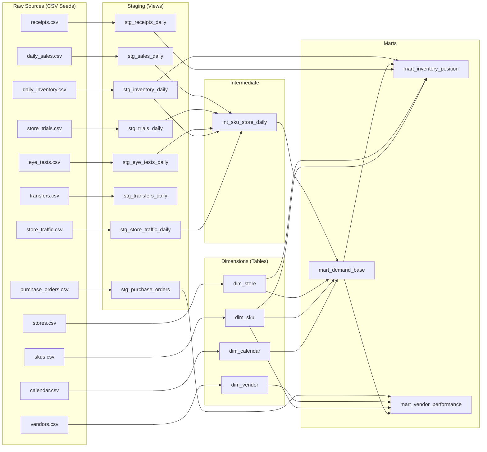

# Lenskart Retail Intelligence Platform

Production-grade monorepo for demand forecasting, assortment optimization, replenishment automation, and vendor collaboration across ~2600 Lenskart stores.

## Architecture



### Key Design Principles

- **Consumer-backwards**: Every decision optimizes for the end consumer experience
- **Store as signal node**: Stores generate demand signals (trials, footfall, eye tests) beyond just sales
- **Dual demand modeling**: Display demand (try-ons) and physical sell-through are modeled separately but linked
- **SKU x Store x Week granularity**: Forecasts at the most actionable level
- **Automated decision loops**: Forecast → Optimize → Execute → Measure

## Repository Structure

```
├── apps/
│   └── api/                    # FastAPI decision APIs
├── orchestration/
│   └── dagster/                # Asset-based DAG definitions
├── transform/
│   └── dbt/                    # Data warehouse modeling (staging → intermediate → marts)
├── ml/
│   ├── features/               # Feature engineering & Feast integration
│   ├── forecasting/            # StatsForecast / HierarchicalForecast
│   ├── optimization/           # OR-Tools replenishment & transfer optimization
│   └── vendor/                 # Automated PO generation
├── services/
│   ├── replenishment/          # Reorder point & replenishment engine
│   ├── assortment/             # Display wall optimization
│   ├── transfers/              # Inter-store transfer engine
│   └── purchase_orders/        # PO lifecycle management
├── schemas/                    # Canonical Pydantic schemas
├── data/synthetic/             # Synthetic data generator
├── infra/docker/               # Docker Compose (Postgres, MLflow, MinIO)
├── tests/                      # Unit, integration, and smoke tests
└── docs/
```

## Quick Start

### Prerequisites
- Python 3.11+
- Docker & Docker Compose (for infrastructure)

### Bootstrap & Run

```bash
# Install dependencies
make install

# Generate synthetic data (50 stores, 500 SKUs, 90 days)
make generate-data

# Run tests
make test

# Start API server (http://localhost:8000/docs)
make api

# Or run everything at once
make demo
```

### Infrastructure (Optional)

```bash
# Start Postgres, MLflow, MinIO
make docker-up

# Run dbt models
make dbt-run

# Start Dagster UI
make dagster-dev

# Stop infrastructure
make docker-down
```

## Data Model

| Entity | Description |
|--------|-------------|
| **stores** | ~2600 stores with type, format, cluster, capacity |
| **skus** | Products with category, fulfillment type (display/direct sell), lifecycle stage |
| **vendors** | Suppliers with lead times, MOQ/MOV, reliability scores |
| **daily_sales** | Daily sales at store x SKU, split by fulfillment type |
| **daily_inventory** | On-hand, on-display, in-storage, in-transit quantities |
| **store_trials** | Try-on events (display demand signal) |
| **store_traffic** | Daily footfall, walk-ins, appointments |
| **transfers** | Inter-store inventory movements |
| **purchase_orders** | Vendor POs with line-level detail |
| **pricing_promotions** | Discount and promotional events |

## Tech Stack

| Component | Technology |
|-----------|-----------|
| Orchestration | Dagster |
| Data Warehouse | dbt + Postgres (DuckDB for local dev) |
| Forecasting | StatsForecast, HierarchicalForecast |
| Optimization | OR-Tools |
| Feature Store | Feast |
| Experiment Tracking | MLflow |
| API | FastAPI |
| Object Storage | MinIO (S3-compatible) |
| Linting | Ruff, mypy |
| Testing | pytest |

## Data Foundation

### Source-to-Mart Lineage



### Demand Signal Semantics

The data model distinguishes three types of demand signals:

| Signal | Source | Meaning | Example |
|--------|--------|---------|---------|
| **sell_through_signal** | `stg_sales_daily` | Physical product sold from store stock | Sunglasses, last-piece eyeglasses |
| **display_interest_signal** | `stg_trials_daily` | Customer tried on a display frame (may not buy) | Try-on of dummy eyeglass frame |
| **prescription_order_signal** | `stg_sales_daily` + `stg_eye_tests_daily` | Order captured after display trial or eye test | Prescription eyewear order |

**Why this matters:** Most Lenskart stores use dummy display frames for try-on. The actual eyeglass is manufactured after prescription capture. So `display_interest_signal` (trials) is a *leading indicator* of demand, while `sell_through_signal` only captures direct-sell items (sunglasses, last-piece stock).

### Key Assumptions

| Assumption | Details |
|------------|---------|
| **Dummy inventory** | Display-only SKUs (`sku_type='display_dummy'`) have `on_hand_qty` = 1-2 and `available_qty` = 0 (not sellable from stock) |
| **Store trials** | Each try-on event = 1 `display_interest_signal`. Conversion rate (~10-15%) indicates how often a trial leads to an order |
| **Eye tests** | ~75% of eye tests result in a purchase. Volume is a strong proxy for prescription demand at a store |
| **Transfer balance** | Each `transfer_id` has paired out/in rows. For completed transfers, out qty = in qty |
| **Inventory snapshots** | Weekly snapshots for most of the year, daily for the last 30 days |
| **Store clusters** | 6 clusters (METRO_HIGH, METRO_MID, TIER1_HIGH, TIER1_MID, TIER2, KIOSK) with distinct demand profiles |

### Synthetic Data Summary

| Dataset | Rows (approx) | Grain |
|---------|---------------|-------|
| stores | 50 | store_id |
| skus | 1,000 | sku_id |
| vendors | 5 | vendor_id |
| calendar | 365 | date_key |
| daily_sales | ~3.5M | store × sku × date |
| daily_inventory | ~2.5M | store × sku × date |
| receipts | ~30K | receipt_id |
| store_trials | ~2M | trial_id |
| eye_tests | ~300K | test_id |
| transfers | ~1.5K | transfer_id × direction |
| purchase_orders | ~130 | po_id |
| store_traffic | ~18K | store × date |
| promotions | ~40 | promo_id |

### Running the Data Pipeline Locally

```bash
# Full pipeline (generate → seed → transform → test → validate)
make data-pipeline

# Or step by step:
make generate-data      # Generate synthetic CSVs
make load-seeds         # Copy CSVs to dbt seeds directory
make dbt-seed           # Load into DuckDB
make dbt-run            # Run all dbt models
make dbt-test           # Run schema + custom tests
make validate-data      # Run data validation checks

# Run the end-to-end smoke test
make test-data
```

### dbt Model Reference

| Layer | Model | Description |
|-------|-------|-------------|
| **staging** | `stg_sales_daily` | Cleaned sales with sell_through and prescription_order signals |
| | `stg_inventory_daily` | Inventory snapshots with stockout flag |
| | `stg_receipts_daily` | Goods receipts from all sources |
| | `stg_transfers_daily` | Inter-store transfers with out/in pairs |
| | `stg_trials_daily` | Try-on events with display_interest_signal |
| | `stg_eye_tests_daily` | Eye tests with prescription_order_signal |
| | `stg_purchase_orders` | POs with delivery delay calculation |
| | `stg_store_traffic_daily` | Daily footfall |
| **dimensions** | `dim_store` | Store master with cluster, format, capacity |
| | `dim_sku` | SKU master with sku_type, fulfillment, lifecycle |
| | `dim_vendor` | Vendor master with lead time, MOQ/MOV |
| | `dim_calendar` | Date dimension with seasons and festive flags |
| **intermediate** | `int_sku_store_daily` | Central daily fact joining all signals |
| **marts** | `mart_demand_base` | Weekly demand at SKU × Store — ML input |
| | `mart_inventory_position` | Current inventory health with WoS classification |
| | `mart_vendor_performance` | Vendor scorecard with delivery and sales metrics |

### Schema Tests & Validations

**dbt schema tests:**
- Unique + not_null on all primary keys
- `accepted_values` for: `fulfillment_type`, `sales_channel`, `sku_type`, `store_cluster`, `inventory_status`, `lifecycle_stage`
- Custom: non-negative inventory, receipt_date >= po_date, transfer_out balances transfer_in

**Data validation checks (Python):**
- Source referential integrity (sales → stores, sales → SKUs)
- Source completeness (expected row counts)
- Mart signal coherence (display_interest_signal only for display SKUs)
- All vendor dimensions present in vendor mart

## API Endpoints

| Endpoint | Description |
|----------|-------------|
| `GET /health` | Health check |
| `POST /api/v1/forecasts/generate` | Generate demand forecasts |
| `GET /api/v1/forecasts/latest` | Retrieve latest forecasts |
| `GET /api/v1/replenishment/plan` | Get replenishment recommendations |
| `POST /api/v1/replenishment/execute` | Execute replenishment plans |
| `GET /api/v1/assortment/recommendations` | Get assortment optimization |
| `GET /api/v1/assortment/clusters` | Get store clusters |
| `GET /api/v1/transfers/recommendations` | Get transfer recommendations |
| `POST /api/v1/transfers/execute` | Execute transfers |
| `POST /api/v1/purchase-orders/create` | Create purchase order |
| `GET /api/v1/purchase-orders/suggestions` | Automated PO suggestions |
