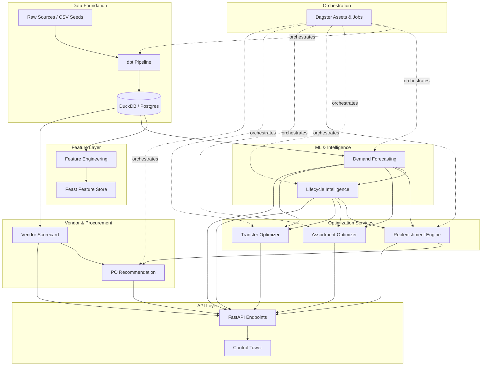
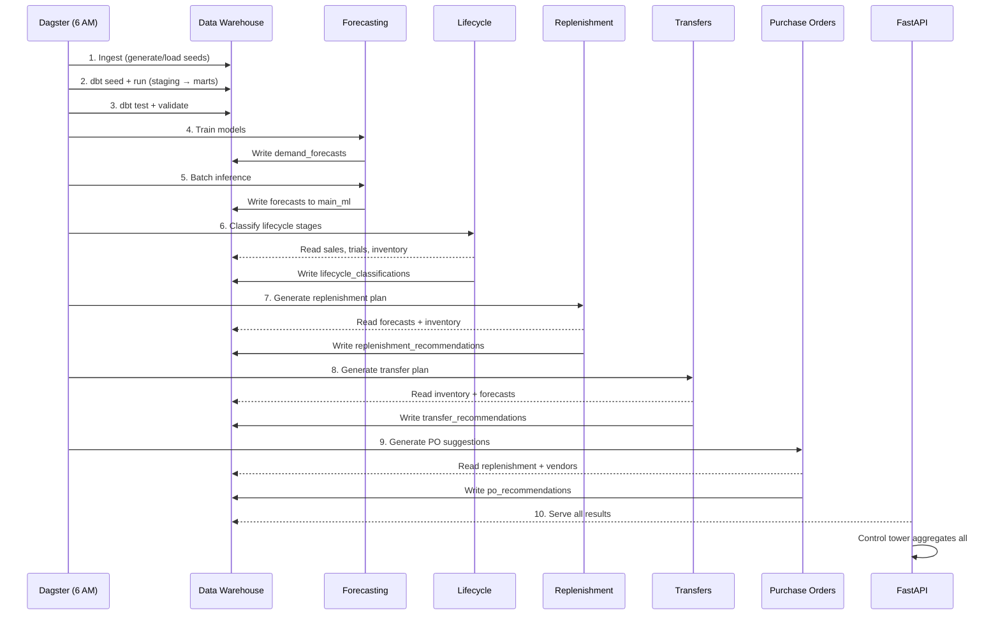

# Architecture Documentation

## System Overview

The Lenskart Retail Intelligence Platform is a unified system for demand forecasting, inventory optimization, and supply chain automation across ~2600 stores.

## Module Dependency Graph



## Daily Pipeline Sequence



## Weekly Pipeline Additions

The weekly job (Monday 4 AM) adds:
- Store clustering refresh
- Assortment optimization for all stores
- Full model retraining with cross-validation

## Data Contracts

### Analytical Tables (main_ml schema)

| Table | Writer | Readers | Key Columns |
|-------|--------|---------|-------------|
| `demand_forecasts` | Forecasting | Replenishment, Transfers, Assortment | store_id, sku_id, forecast_week, point_forecast |
| `lifecycle_classifications` | Lifecycle | Forecasting, Assortment, Replenishment | sku_id, lifecycle_stage, confidence, recommended_action |
| `replenishment_recommendations` | Replenishment | PO Engine, API | sku_id, destination_store, recommended_qty, urgency |
| `assortment_recommendations` | Assortment | API | store_id, sku_id, composite_score, action |
| `transfer_recommendations` | Transfers | API | from_store_id, to_store_id, sku_id, qty, net_value |
| `po_recommendations` | PO Engine | API | po_id, vendor_id, sku_id, qty_ordered, line_value |

### Mart Tables (main_marts schema)

| Table | Description | Key Consumers |
|-------|-------------|---------------|
| `mart_demand_base` | Weekly demand at SKU x Store | Forecasting, Lifecycle |
| `mart_inventory_position` | Current inventory health | Replenishment, Transfers |
| `mart_vendor_performance` | Vendor scorecard metrics | PO Engine, Vendor API |

## Service Architecture

Each service follows a consistent pattern:

```
services/<domain>/
├── config.py        # Dataclass configuration with business rules
├── data_loader.py   # DuckDB queries to load inputs
├── engine.py        # Core business logic / optimization
├── pipeline.py      # Orchestration: load → compute → write
└── simulation.py    # Synthetic data comparison (heuristic vs optimized)
```

### Configuration Pattern
All services use `@dataclass`-based configs with:
- Database paths and table names
- Business rule thresholds
- Solver parameters
- Sensible defaults that work out of the box

### Pipeline Pattern
Every `pipeline.py` follows:
1. Load data from DuckDB
2. Run computation (engine/classifier/optimizer)
3. Write results back to DuckDB
4. Log summary
5. Return typed result (DataFrame or dataclass)

## API Architecture

```
apps/api/app/
├── main.py                    # FastAPI app with CORS, router registration
└── routers/
    ├── health.py              # GET /health, /ready
    ├── control_tower.py       # GET /api/v1/control-tower/summary
    ├── forecasts.py           # /api/v1/forecasts/*
    ├── lifecycle.py           # /api/v1/lifecycle/*
    ├── replenishment.py       # /api/v1/replenishment/*
    ├── assortment.py          # /api/v1/assortment/*
    ├── transfers.py           # /api/v1/transfers/*
    ├── vendors.py             # /api/v1/vendors/*
    └── purchase_orders.py     # /api/v1/purchase-orders/*
```

Each router:
- Defines Pydantic request/response models
- Uses lazy imports for service code (avoids import-time failures)
- Queries DuckDB directly for read endpoints
- Delegates to service pipelines for write/run endpoints

## Dagster Asset Graph

```
ingest:     synthetic_data → load_seeds → dbt_seed
transform:  dbt_staging → dbt_dimensions → dbt_intermediate → dbt_marts
quality:    dbt_tests, data_validation
ml:         demand_forecast_train → demand_forecast, feature_materialization, store_clustering
intelligence: lifecycle_classification
optimization: replenishment_plan, assortment_plan, transfer_plan
vendor:     purchase_order_suggestions
```

### Asset Dependencies

| Asset | Depends On |
|-------|------------|
| `demand_forecast` | `demand_forecast_train` |
| `lifecycle_classification` | `demand_forecast` |
| `replenishment_plan` | `demand_forecast`, `lifecycle_classification` |
| `assortment_plan` | `demand_forecast`, `lifecycle_classification`, `store_clustering` |
| `transfer_plan` | `demand_forecast`, `lifecycle_classification` |
| `purchase_order_suggestions` | `replenishment_plan` |

## Integration Points

### Lifecycle → Forecasting
- Lifecycle writes `main_ml.lifecycle_classifications`
- Forecasting reads it in `_apply_lifecycle_adjustments()` to apply:
  - Forecast floors for launch SKUs
  - Wider uncertainty bands for decline/exit SKUs

### Lifecycle → Assortment
- `LIFECYCLE_FRESHNESS_SCORES` merged into assortment scoring
- Stale penalty extended for `decline` and `exit` stages
- New launch detection uses lifecycle stage

### Forecasting → Replenishment
- Forecasts provide `point_forecast` and `upper_bound` for safety stock
- Replenishment computes reorder points and order-up-to levels

### Replenishment → PO Engine
- PO engine reads replenishment recommendations
- Groups needs by vendor, applies MOQ/MOV, scores vendors
- Generates PO recommendations with vendor allocation

### All → Control Tower
- Single endpoint aggregates state from all `main_ml.*` and `main_marts.*` tables
- Provides unified operational dashboard view
